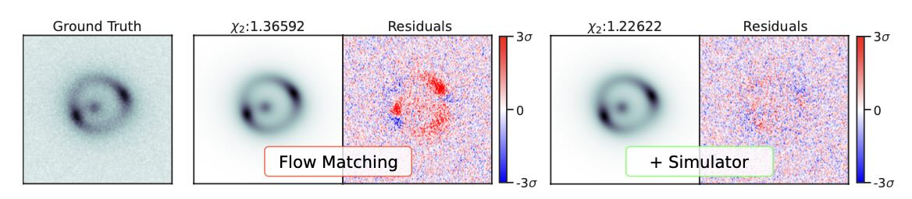

# Flow Matching for Posterior Inference with Simulator Feedback (SBI-SIM)

This is the repository for our paper [Flow Matching for Posterior Inference with Simulator Feedback](https://arxiv.org/abs/2410.22573).

Please stay tuned for the source code, coming up soon!

**Paper abstract:**
Flow-based generative modeling is a powerful tool for solving inverse
problems in physical sciences that can be used for sampling and likelihood
evaluation with much lower inference times than traditional methods. We propose
to refine flows with additional control signals based on a simulator. Control
signals can include gradients and a problem-specific cost function if the
simulator is differentiable, or they can be fully learned from the simulator
output. In our proposed method, we pretrain the flow network and include
feedback from the simulator exclusively for finetuning, therefore requiring
only a small amount of additional parameters and compute. We motivate our
design choices on several benchmark problems for simulation-based inference and
evaluate flow matching with simulator feedback against classical MCMC methods
for modeling strong gravitational lens systems, a challenging inverse problem
in astronomy. We demonstrate that including feedback from the simulator
improves the accuracy by 53%, making it competitive with traditional
techniques while being up to 67x faster for inference.

